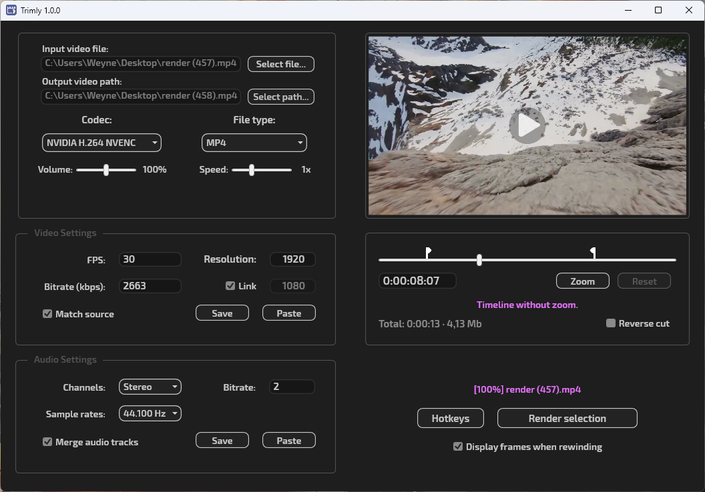

# Trimly - Simple video converter
Windows (.NET 4.8) app based on WPF & Ffmpeg.

> [!IMPORTANT]  
> If you are not using the installer, you need [download](https://www.ffmpeg.org/download.html#build-windows) the executable files **ffmpeg.exe**, **ffprobe.exe** and place them in the program folder.

### Features:
- Trim;
- Change meta (FPS, resolution, bitrate, etc.)
- Change speed and volume;
- Convert to MP4, MKV, MOV or AVI;
- Extract MP3 or AAC audio from video;
- Merge all audio tracks into one.
- H.264 codec support for NVIDIA, AMD and Intel GPUs,

## Screenshots

## Support
This is my second pet project. If you like this, leave a :star: (top right) and become a [stargazer](https://github.com/Weyne1/trimly/stargazers)!

## Credits
This software uses code of [FFmpeg](http://ffmpeg.org) licensed under the [LGPLv2.1](http://www.gnu.org/licenses/old-licenses/lgpl-2.1.html).
